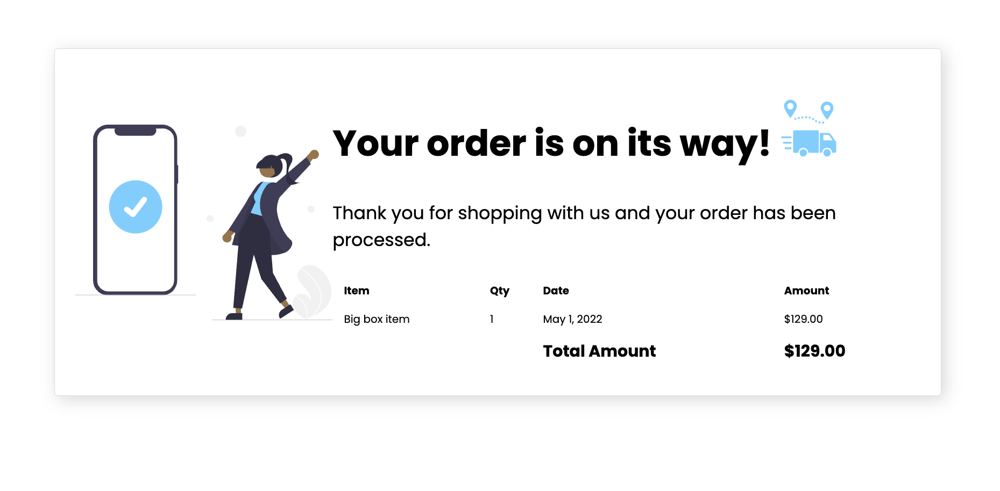

# I18nReceiptDemo

This project is an example of how to internationalize and localize an application in Angular.

A [video walkthrough is available on YouTube](https://youtu.be/KNTN-nsbV7M).

## Getting Started
- Install the latest version of the Angular CLI: `npm install -g @angular/cli`
- Download this repository
- `cd` into the directory
- Run `npm install` to download all dependencies
- Run `ng serve` to start the application.
- Navigate to `http://localhost:4200/`. 

## Resources
- [Introduction to Angular Codelab](https://codelabs.developers.google.com/introduction-to-angular)
- [Introduction to Angular Workshop](https://youtu.be/qxchrt04bTA)
- [Internationalization in Angular](https://angular.io/guide/i18n-overview)

## Further help
To get more help on the Angular CLI use `ng help` or go check out the [Angular CLI Overview and Command Reference](https://angular.io/cli) page.

This project was generated with [Angular CLI](https://github.com/angular/angular-cli) version 13.1.3.